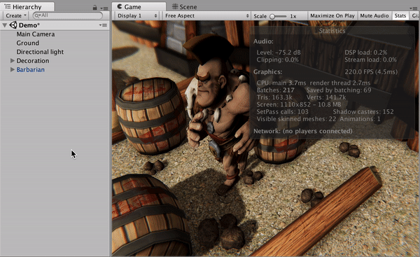

## Description

**Simplest Mesh Baker** is a small plugin that helps you bake several meshes to one in couple clicks.

In addition, it contains a **Bone Baker**. It is a simple wrapper over [SkinnedMeshRenderer.BakeMesh()](https://docs.unity3d.com/ScriptReference/SkinnedMeshRenderer.BakeMesh.html) method, which allows you to convert `SkinnedMeshRendered` to `MeshRenderer` considering transformations and poses.

## How to use

To install it, copy the **Simplest Mesh Baker** folder to your project.

 

To bake the Meshes, select `GameObjects` with `MeshRenderer` or `SkinnedMeshRenderer` components on it or its children, make a right click and press **Bake Meshes**.

One Mesh can't contain more than 65,000 vertices, so if source meshes together have more than 65,000 vertices, **Simplest Mesh Baker** will create several objects.

The plugin will ask you: "*Do you want to separate objects with different materials?*". If you choose "*Yes*" **Simplest Mesh Baker** will bake source objects with different materials to the separated Meshes. If "*No*" **Simplest Mesh Baker** will bake all the meshes together and set one of the source materials for it.

Also if several but not all meshed use `UVs`, `Vertex Colors`, or `Normals` **Simplest Mesh Baker** will ask how to resolve it. You can remove it from all objects or create with default values where it needed.

Then **Simplest Mesh Baker** will ask you: "*Do you want to remove sources?*". Click "*Yes*" if so, or "*No*" if you want to leave these objects for now.

Then the plugin will show a popup with the number of baked objects.

 

To use **Bones Baker**, select `GameObjects` with `SkinnedMeshRenderer` components on it or its children, make a right click and press **Bake Bones**.
The plugin will ask you: "*Do you want to remove bones after backing?*". Press "*Yes*" if so, or "*No*" if you want to leave bones for now.

## YouTube Tutorials

[How to Bake Meshes](https://youtu.be/UxkcC0uZ6D8)

[How to Bake Bones](https://youtu.be/95zAFspba1E)
